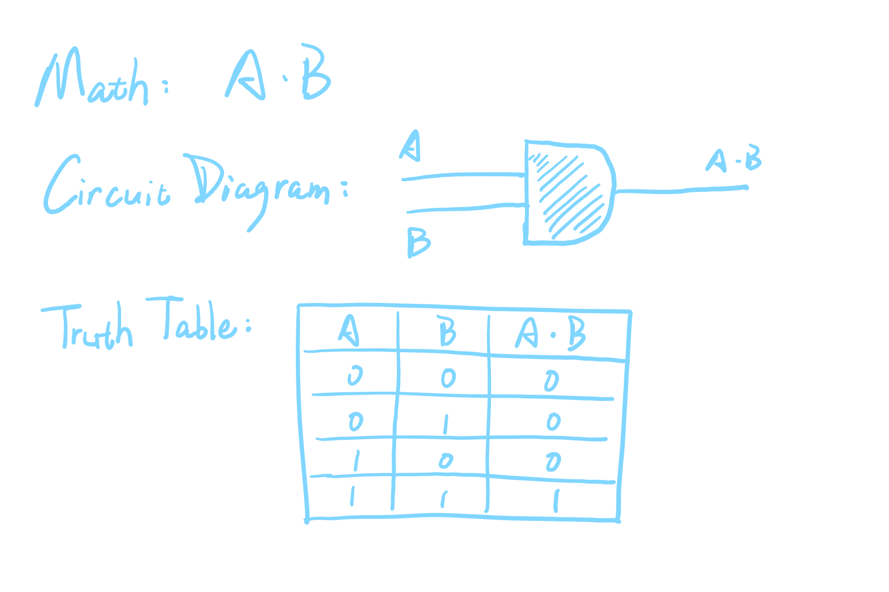
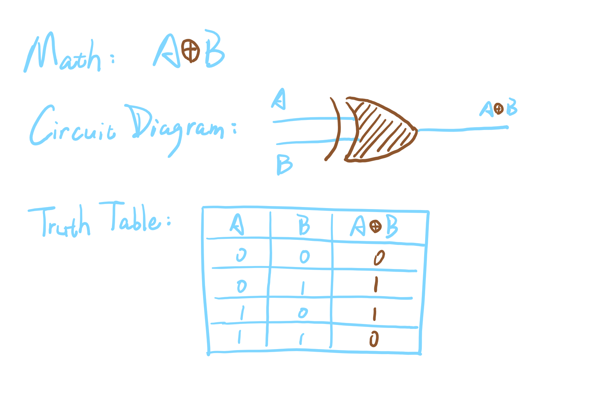
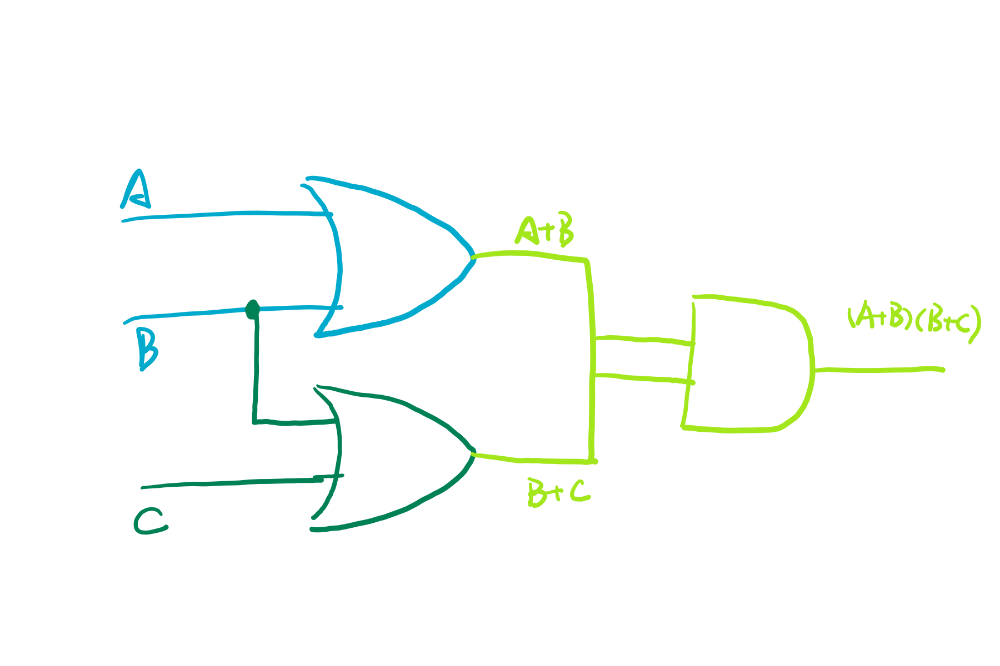
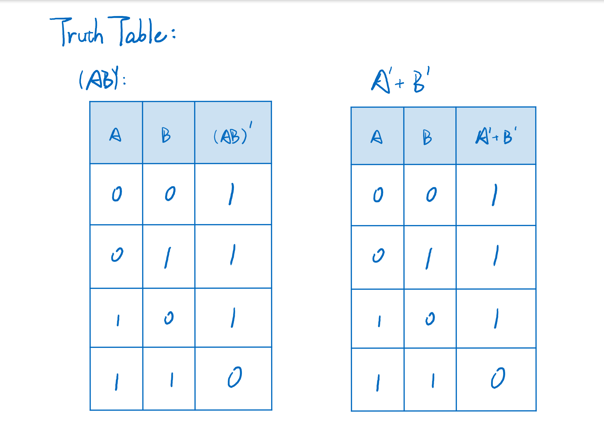
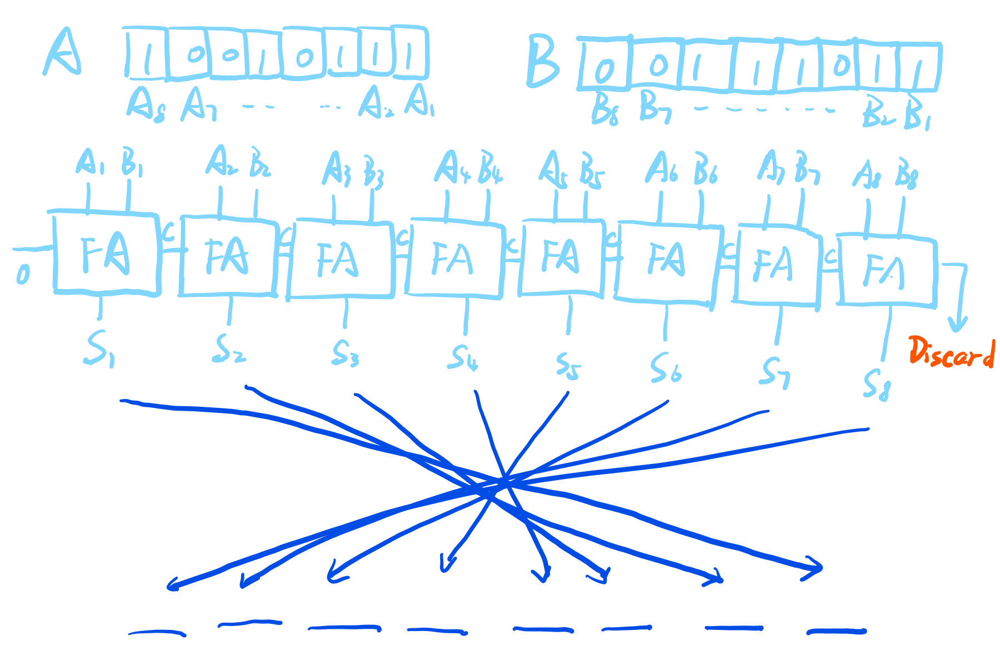
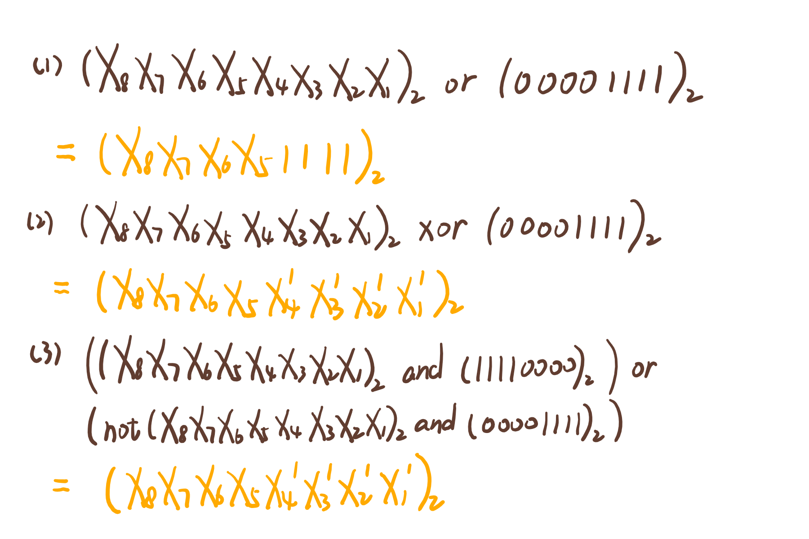

## Part 1 - 门电路

1. AND gate:

The result is 1 if and only if both A and B are 1, else the result is 0.

2. XOR gate

The result is 1 if and only if A and B are different, else the result is 0.

3. The following diagram is the one of `(A + B)(B + C)`.

4. The truth table of the circuit:

A  | B   | Result
:--|:----|:-------
0  | 0   | 1
0  | 1   | 1
1  | 0   | 0
1  | 1   | 1

5. 
If the two circuits which receive same pair of A and B produce the same result, then the two circuits are circuit equivalence of each other.

Prove:

Same pair of A and B produces the same result. So the two formulas are circuit equivalence of each other.

6. In the following diagram, Ax represents the X bit of number A(counted from the right) and Bx does so. FA represents a Full Adder illustrated in the homework requirements.

7. Filling the follow expressions:

## Part 2 - 解释名词

1. Logic gate
    - In electronics, a **logic gate** is an idealized or physical device implementing a Boolean function; that is, it performs a logical operation on one or more binary inputs and produces a single binary output. 
    - 在电学中，**逻辑门**是一个用于引入布尔功能的理想化或实际存在的设备。也就是说，它能够对一个或两个二进制输入进行处理，并产生一个二进制输出。

2. Boolean algebra
    - In mathematics and mathematical logic, **Boolean algebra** is the branch of algebra in which the values of the variables are the truth values true and false, usually denoted 1 and 0 respectively.
    - 在数学和逻辑数学中，**布尔代数**是代数的一个分支。其特点是，变量的值都是真值（逻辑值）：真和假，通常以 1 和 0 来表示。

## Part 3 - Flip-flop

1. 中文翻译：触发器
2. I guess it can store 1 bit. (Maybe