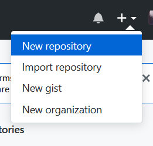
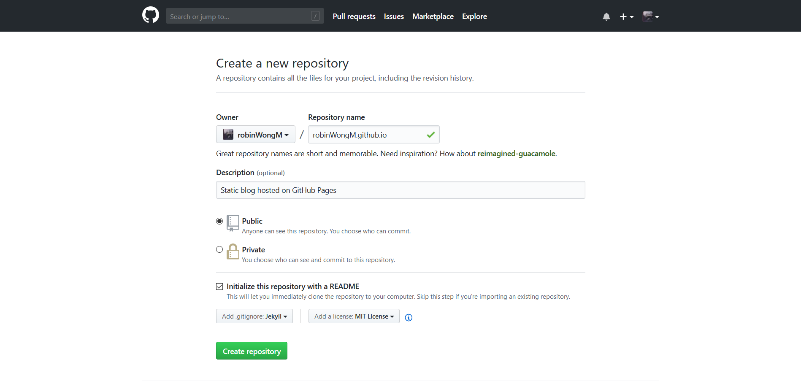
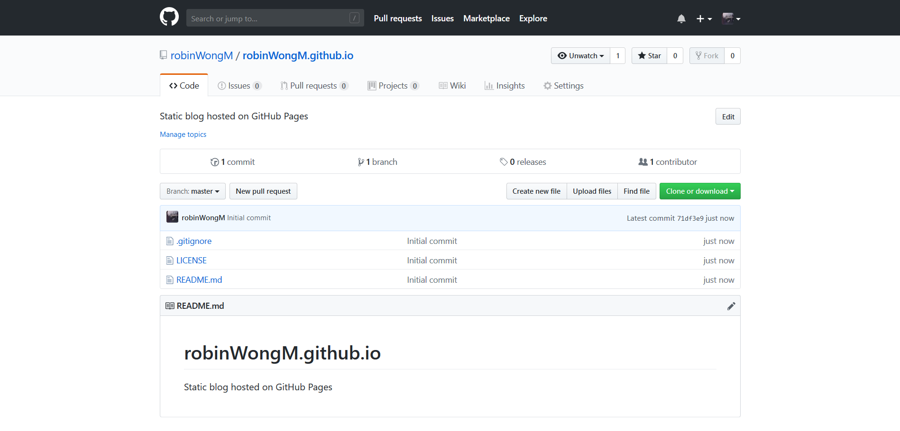
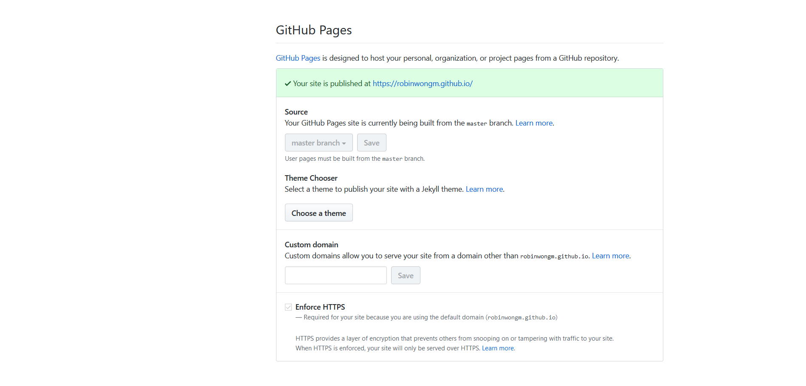
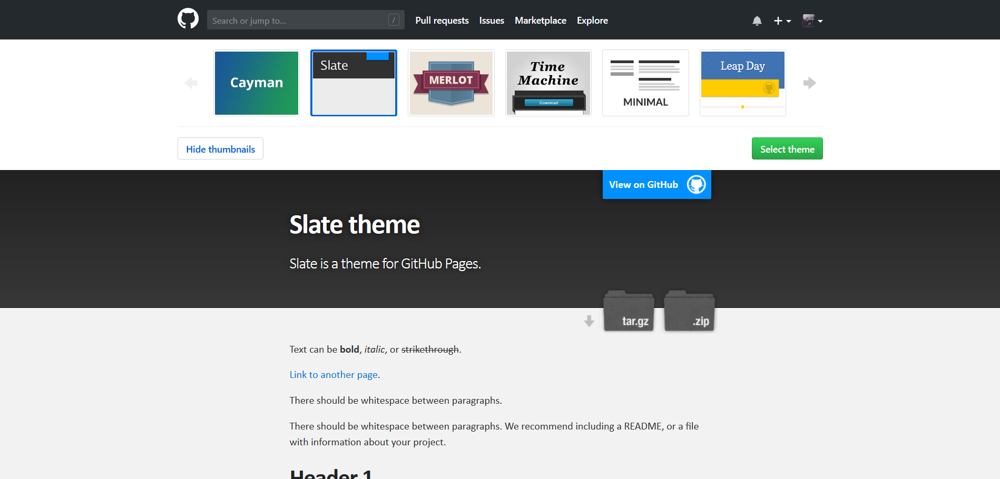
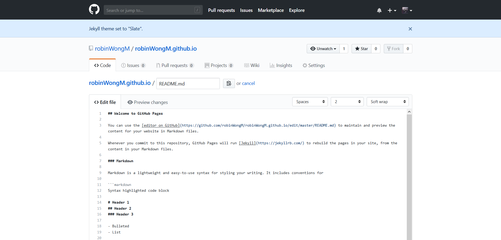
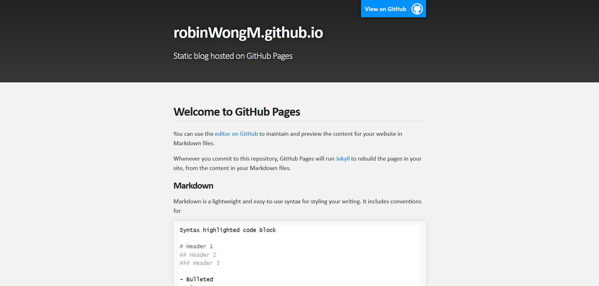
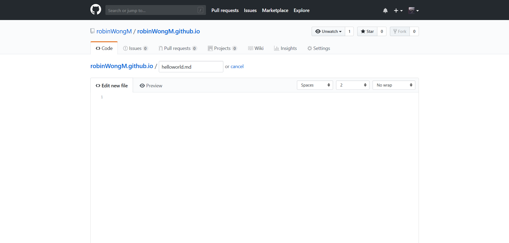
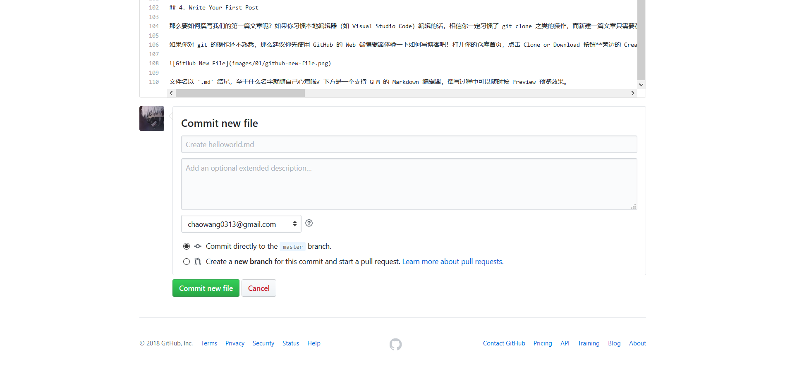

# Homework 01 - Setting up a Static Tech Blog on GitHub with Jekyll

首先是一段碎碎念，可以跳过不看。

是的，这一次已经不知道是我第几次搭建技术博客了，之前的技术博客其实也一直是与生活博客混杂在一起的，通常写了没几篇文章后博客就长草了:) 这次刚好碰上做这个神奇的作业再搭一次，且看这个博客能存活多久吧 Orz

刚开始接触博客的时候，那时还流行着 QQ 空间，高端一点的可能是博客大巴。但是作为混迹免费空间的我们这群小学生来说，自然是找到一个 PHP + MySQL 的免费空间然后放上我们觉得十分笨重的 WordPress，绑定上一个免费的域名（通常是二级域名，比如 [已经挂了的 .co.cc](https://www.moonlol.com/co-cc%E9%97%9C%E9%96%89%E5%81%9C%E6%AD%A2%E5%85%8D%E8%B2%BB%E5%9F%9F%E5%90%8D-1360.html)；而像什么 .tk 这种免费的顶级域名则被我们奉为珍宝），搭建一个「极客范」的独立博客。

但是 WordPress 它，在那个时候，在免费空间上，装了什么 SEO 之类的插件以后，真 的 好 慢 啊。于是之后我们又转投 Typecho，一个比 WP 轻量得多的 PHP 博客程序。也从此开始，我们逐步接触了「制作博客主题」这件事情，了解了 HTML/CSS/JavaScript 和 PHP 本身。

再后来，我们了解到 PHP 并不是独立博客的唯一选择。GitHub Pages 带动了静态博客的发展，Ghost 等基于 Node.js 的博客程序也在高中的时候进入了我们的视野当中。我曾经尝试过一段时间的静态博客，一开始的平台也是 GitHub Pages，但并不是原生支持的 Jekyll，而是使用 Node.js 开发的 Hexo，两年以前还 Fork 过一个很漂亮的主题 [tranquilpeak](https://github.com/robinWongM/hexo-theme-tranquilpeak)，根据自己的需求定制了某些东西。

不过贵友可能听说过 `node_modules hell`，当时 Hexo 生成博客的速度慢到令人发指，尤其是当主题使用了 npm 进行依赖管理时，在我的辣鸡电脑上生成一个含有三篇文章的博客居然耗时半分钟。这时我们又了解到一个使用 Go 语言制作而成的静态博客程序 Hugo，速度那叫一个快，就是主题等生态资源并不如 Hexo 丰富。这个博客程序我使用的时间相对来说比较长，之前一直运行在 Coding Pages 上。

当然，上面的这些无一例外，现在都已不复存在。与其说是 404 Not Found，不如说我已经懒得再去寻找那堆黑历史存放的地方了。

期待新的征程。

## 1. Register GitHub Account

> 应非常简单。—— 赖老师

像很多热衷于吸引新用户注册的网站一样，GitHub 在首页第一屏的右侧放置了一个巨大的用户注册表单，只需输入自己想要的用户名、自己的邮箱与一个健壮的密码，点击 Sign up for GitHub 的超巨大绿色按钮，即可进入注册流程。

因为自己的账号是很久以前注册的，我也已经不太记得当时的注册流程，根据舍友们的反馈，进去之后的第一步是「全自动机器人验证」，如无意外的话，在菊花转完之后就会出现一个绿色的大勾，之后点 Create Account 按钮即可进入下一步。但由于国内的网络环境，菊花转的时间比较长，而且就算出现绿色大勾后点击 Create Account 也会重新进入这个第一步，像是出现了死循环。若发生这种情况，建议更换连通性更好的网络环境。

之后的第二步是选择 Plan 以及是否订阅邮件之类的选项，一般使用 Unlimited Public Repositories 选项即可。如果对 Private Repositories 有要求的同学，可以稍后申请 GitHub Education Pack，在大学期间会免费赠送 Private Repositories。

最后一步是填写有关于自己将如何使用 GitHub 的信息，可以点击 Skip 跳过。此时你的邮箱应收到一封来自 GitHub 的验证邮件，点击邮件中的 Verify your email 链接即可。

## 2. Create Your Repository

GitHub Pages 的官方介绍说它 "Hosted directly from your GitHub repository" ，也就是说一个 GitHub repository 就相当于我们用于存放网页文件的空间，我们只需要把网页文件或博客文章通过 Git 的方式 commit & push 到一个 GitHub repository 上，就可以实现博客的搭建，前提是网站是静态的。

于是我们的第二步就是创建一个新的 Repository（下称 Repo）。在上一步的结尾验证完邮箱地址后，你将看到（属于你的） GitHub 首页：

或者这样的：

不论何种，都可以在右上角找到一个 + 号，点击之后点击其中的 New Repository：

之后我们就进入了新建 Repo 的页面。

首先给你的新 Repo 指定一个名字。在此之前，我们先了解一下 GitHub Pages 的两种网站类型：

- Account/Orgranization Sites
  - 每个账户/组织只能有一个
  - 通过 `https://<Your GitHub Username>.github.io/` 访问
  - 仓库名是固定的，为`<Your GitHub Username>.github.io`

- Project Sites
  - 每个账户/组织拥有的数量无限
  - 通过 `https://<Your GitHub Username>.github.io/<Your Repository Name>` 访问
  - 仓库名是任意的

所以请根据自己的需要制定这个新 Repo 的名字，并填写 Description（可选）。

这里以 `robinWongM.github.io` 为例：

为了可以马上在电脑上 Clone 这个 Repo，我选择 Initialize this repository with a README. 下方的 Add .gitignore，我选择了 Jekyll；Add a license 我选择了 MIT License。有兴趣的同学可以 Google 一下了解有关 License 的知识。

点击 Create Repository 后，浏览器会跳转到你的新 Repo 页面：

## 3. Configure Your Jekyll

这个时候我们就可以开始配置我们的 Jekyll 了。点击仓库页面仓库名字下方 Tab 栏上的 Settings，进入仓库设置，往下滑滑滑滑到 GitHub Pages：

这里你可以看到一个名为 Choose a theme 的按钮，点击它，进入主题选择器：

按照作业的要求，这里选择 Slate 主题后按下 Select theme 的绿色按钮，GitHub 便会生成一个默认的 README.md 和 _config.yaml，确认提交后便完成了 Jekyll 的初始化：

此时访问你的 Pages，默认会展示 README.md 里的内容：

## 4. Write Your First Post

那么要如何撰写我们的第一篇文章呢？如果你习惯本地编辑器（如 Visual Studio Code）编辑的话，相信你一定习惯了 git clone 之类的操作，而新建一篇文章只需要在仓库根目录新建一个任意名字的 `.md` 文件，如果你喜欢的话还可以新建一个 `index.md` 文件，自行建立博文索引。

如果你对 git 的操作还不熟悉，那么建议你先使用 GitHub 的 Web 端编辑器体验一下如何写博客吧！打开你的仓库首页，点击 Clone or Download 按钮**旁边的 Create new file 按钮**，即可进入新建文件的页面：

文件名以 `.md` 结尾，至于什么名字就随自己心意啦√ 下方是一个支持 GFM 的 Markdown 编辑器，撰写过程中可以随时按 Preview 预览效果。Markdown 有不同的标准，GitHub 支持的标准是 GFM（GitHub Flavored Markdown），具体 Spec 参见 [https://github.github.com/gfm/](https://github.github.com/gfm/)，虽然看起来对新手并不是很友好... 所以还是看这个吧：[https://guides.github.com/features/mastering-markdown/](https://guides.github.com/features/mastering-markdown/)

撰写完成后，填好 Commit message 与 description，点击 Commit new file：

Well done! 我们的第一篇文章就诞生了！假设你的新文章文件名为 helloworld.md，那么我们便可以通过 `https://<你的用户名>.github.io/<你的仓库名,可选>/helloworld.html` 访问到你的文章了:)

## 5. Customize Your Blog

至此，我们的博客便基本搭建完成了，可如果我们还需要一些个性化功能，比如说自己制作主题、给不同的页面设置不同的样式、甚至自动生成 index.md 文件的话，我们还需要一些进阶的操作。

那么这些操作在哪里可以看到呢？

未完待续。