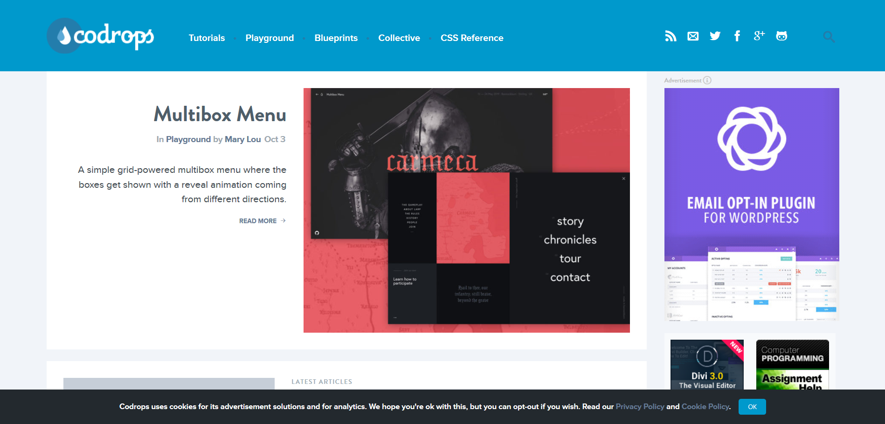
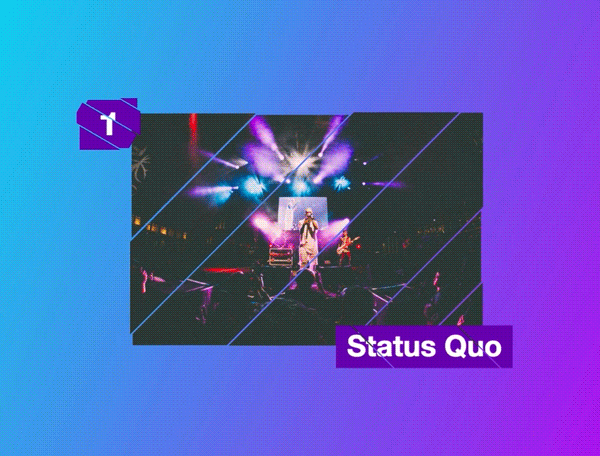

## Lab 03 - Codrops：创意与技术的火花交汇之处

今天给大家介绍的是自己钟爱的一个网站：[Codrops @ Tympanus](https://tympanus.net/codrops/)。IT 技术不是冰冷的，正如这里的网页是可以好看的，是可以好玩的，是可以炫酷到爆炸的。

我们可能对 HTML5/CSS3/JavaScript 这些词再熟悉不过了，犹记当年各大浏览器开始支持 CSS3 时，大家一个劲儿地用起了 `box-shadow`（虽然现在看来挺杀马特的）、一个劲儿地用起了 `border-radius`，一个前端工程师自己就是设计师，摆上各种花里胡哨的属性，以至于看起来多有点纯粹炫技的感觉。那真正的设计师们呢？他们面对的，反而可能是那些看了 PSD 与动效演示后就想打人的码农们。技术与创意，似乎总会有一条明显的分界线。

但是在这个网站里，它们得到了完美的融合。

这个网站有好些个栏目，比如经典的 Tutorials，也有定期赠送免费资源的 Freebies，不过我最喜欢的还是 Playground。主笔 Mary Lou 每隔一段时间就能在这个栏目里用有限的技术实现的惊人创意。

有接触过 HTML 开发的同学们大概能够想象做出这种效果有多么难。

除此之外，Codrops 经常分享一些某些交互细节的提升方法，比如 Button 的 Hover 效果如何做得更好？用户表单输入如何能够更加 Focus？

以上这些，有赖于你的发现。来吧！[Codrops @ Tympanus](https://tympanus.net/codrops/)