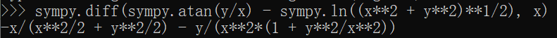
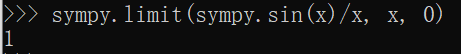
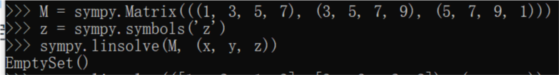
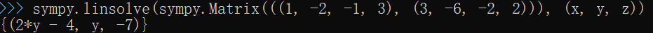

## Part 01 - 高数作业

1. 隐函数求导：$\arctan\frac{y}{x}=\ln\sqrt{x^{2}+y^{2}}$

2. 求解极限：$\lim_{x \rightarrow 0}\frac{\sin x}{x}$

## Part 02 - 线代作业

1. $$\begin{bmatrix}1 & 3 & 5 & 7 \\ 3 & 5 & 7 & 9 \\ 5 & 7 & 9 & 1 \end{bmatrix}$$

2. $$\begin{bmatrix}1 & -2 & -1 & 3 \\ 3 & -6 & -2 & 2\end{bmatrix}$$

