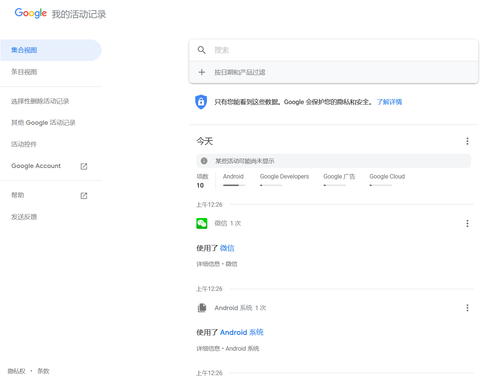
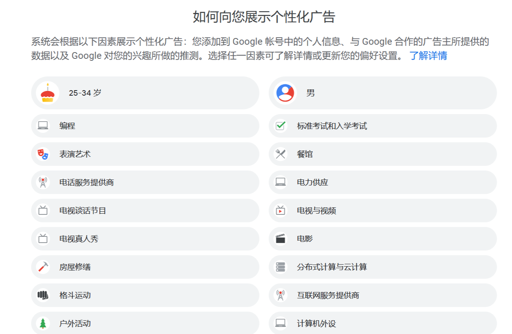

# Lab 11 - 巨头与数据收集

每一家互联网巨头，如 Google 和 Facebook，都会发布它们的隐私权政策。从他们公布的隐私权政策，并结合他们网站的网页 / JavaScript 代码，可以了解到它们正不断地通过各种方式收集用户的数据，成为这些巨头们的资产。一起来看看。

## Example 1: Google

以下 blockquote 部分为 Google 的[隐私权政策](https://policies.google.com/privacy?hl=zh-CN&gl=zz)的部分摘录：

<blockquote>
您的活动

我们会收集您在 Google 服务中的活动信息，并会利用这些信息做一些事情，例如推荐您可能喜欢的 YouTube 视频。我们收集的活动信息可能包括：

- 您搜索的字词
- 您观看的视频
- 浏览内容和广告的次数以及与它们互动的次数
- 您在使用音频功能时的语音和音频信息
- 购买活动
- 您的交流对象或您分享内容的对象
- 在使用 Google 服务的第三方网站和应用中的活动
- 已与您的 Google 帐号同步的 Chrome 浏览记录

如果您使用我们的服务接打电话或收发消息，我们可能会收集电话日志信息，例如您的电话号码、主叫方号码、接收方号码、呼叫转移号码、通话和收发消息的时间和日期、通话时长、路由信息以及通话类型。

您可以在自己的 Google 帐号中查找和管理保存在您帐号名下的活动信息。
</blockquote>

单纯的文字表述可能并不让人理解。如果您使用 Google 服务，您可以到[https://myactivity.google.com](https://myactivity.google.com)查看 Google 记录的活动信息。以下是我的一个例子，Google 记录了我使用 Android 手机时何时打开了哪些应用，以及 Chrome 的浏览记录。

> 我们会利用各种技术收集和存储信息，包括 Cookie、像素代码、本地存储（例如使用浏览器进行网络存储或应用数据缓存）、数据库和服务器日志。

在很多网站上随处可见的（不仅仅在 Google Search Engine 上）Google 广告，以及 Google+ 按钮等，在载入他们的时候，Google 都会读取/更新用户浏览器中 Google 的 Cookie。Cookie 是一个小文本片段，存储在浏览器中，并可被其指定的特定网站所读取。通过设置 Cookie，Google 可以在任何加载了 Google 资源的网站上获取用户标识符，以标识当前用户，推送个性化推荐，并记录用户的足迹与偏好。像素代码是一个 1*1 大小的图片，并且不可见，也用于通过 Cookie 追踪用户。

Google 会利用这些数据给用户“打标签”，以推送个性化广告，提高广告的点击率与营收。可以在(https://adssettings.google.com/authenticated)[https://adssettings.google.com/authenticated]看到 Google 给你“打的标签”。

<blockquote>
活动控件

确定您想要将哪些类型的活动保存在自己帐号名下。例如，如果您想获得每日通勤路线的路况预测信息，则可以开启位置记录功能；您也可以保存 YouTube 观看记录，以获得更理想的视频推荐。

[转到“活动控件”](https://myaccount.google.com/activitycontrols?utm_source=pp&hl=zh_CN)
</blockquote>

Google 给予了用户是否将自己的数据与自己相关联起来的权力。但是解除关联并不意味着 Google 停止收集用户的数据，而仅仅是不再相关联起来。这些数据可以作为大数据样本，为 Google 所分析利用。

## Example 2: WeChat

以下 blockquote 部分摘录于[微信隐私保护指引](https://weixin.qq.com/cgi-bin/readtemplate?lang=zh_CN&t=weixin_agreement&s=privacy) 与 [腾讯隐私政策](https://privacy.qq.com/)。

> 我们可能将通过某些功能所收集的信息用于我们的其他服务。例如，我们可能将你在使用我们某一功能或服务时我们收集的信息，在另一功能或服务中用于向你提供特定内容，包括但不限于展示广告（你可以在关于广告页面中了解更多）、对你阅读过的内容进行信息安全类提示、**基于特征标签进行间接人群画像**并提供更加精准和个性化的服务和内容等。

<blockquote>

6.4

我们会将所收集到的信息用于大数据分析。例如，我们将收集到的信息用于分析形成不包含任何个人信息的**城市热力图或行业洞察报告**。我们可能对外公开并与我们的合作伙伴分享经统计加工后不含身份识别内容的信息，用于了解用户如何使用我们服务或让公众了解我们服务的总体使用趋势。

</blockquote>

同样地，微信也会利用其掌握的海量用户数据进行人群画像，即大数据分析。每一年的“微信公开课 Pro”都放出了有关话题的统计数字。

<blockquote>
1.2.2 位置信息。当您使用与位置有关的服务时，我们可能会记录您设备所在的位置信息，以便为您提供相关服务。

(1) 在您使用服务时，我们可能会通过IP地址、GPS、WiFi或基站等途径获取您的地理位置信息；

(2) 您或其他用户在使用服务时提供的信息中可能包含您所在地理位置信息，例如您提供的帐号信息中可能包含的您所在地区信息，**您或其他人共享的照片包含的地理标记信息**；
</blockquote>

手机相机拍摄时所记录下的 EXIF 中通常默认包括了位置信息。微信可以借此分析你的照片拍摄足迹，得出你的出行偏好和活动习惯。